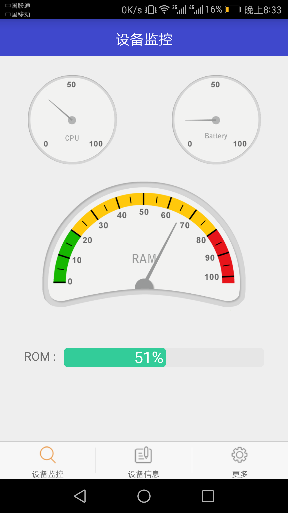
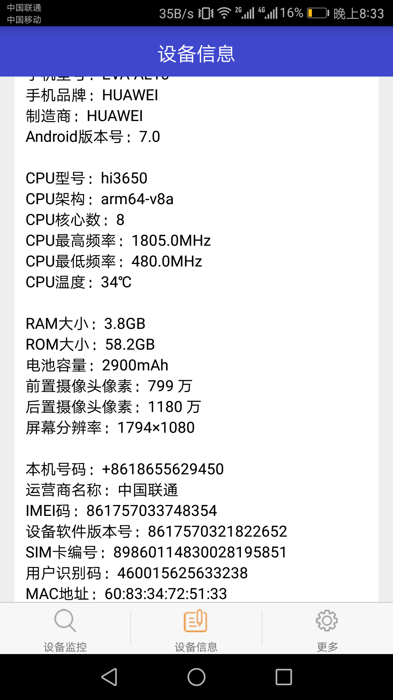

Sysmonitor
==========
An APP which can monitor the system and inquire hardware information.




## System monitor
(1) RAM usage
```java
public static float getUsedPercentValue(Context context) {
	String dir = "/proc/meminfo";
	try {
		FileReader fr = new FileReader(dir);
		BufferedReader br = new BufferedReader(fr, 2048);
		String memoryLine = br.readLine();
		String subMemoryLine = memoryLine.substring(memoryLine.indexOf("MemTotal:"));
		br.close();
		long totalMemorySize = Integer.parseInt(subMemoryLine.replaceAll("\\D+", ""));
		long availableSize = getAvailableMemory(context) / 1024;
		float percent = (float) ((totalMemorySize - availableSize) / (float) totalMemorySize);
		return percent;
	} catch (IOException e) {
		e.printStackTrace();
	}
	return 0;
}
```
(2) ROM usage
```java
stat = new StatFs(Environment.getExternalStorageDirectory().getPath());
totalBlocks = stat.getBlockCount();
availableBlocks = stat.getAvailableBlocks();
degree4 = (int) ((totalBlocks - availableBlocks) * 100 / totalBlocks);
```
(3) Battery level
```java
private BroadcastReceiver broadcastReceiver = new BroadcastReceiver() {
        @Override
        public void onReceive(Context context, Intent intent) {
		batteryLevel=intent.getIntExtra(BatteryManager.EXTRA_LEVEL,0);
            	batteryScale=intent.getIntExtra(BatteryManager.EXTRA_SCALE,100);
            	degree3 = (float) (2.7 * (batteryLevel * 100 / batteryScale));
		RotateAnimation animation3 = new RotateAnimation(degree3, 
				degree3, Animation.RELATIVE_TO_SELF, 0.5f,
				Animation.RELATIVE_TO_SELF, 0.5f);
		animation3.setDuration(1000);
		animation3.setFillAfter(true);
		needleView3.startAnimation(animation3);
        }
};
```
(4) CPU usage
```java
public void readUsage( ){
	try{
		BufferedReader reader = new BufferedReader( new InputStreamReader( new FileInputStream( "/proc/stat" ) ), 1000 );
		String load = reader.readLine();
		reader.close();     
		String[] toks = load.split(" ");
		long currTotal = Long.parseLong(toks[2]) + Long.parseLong(toks[3]) + Long.parseLong(toks[4]);
		long currIdle = Long.parseLong(toks[5]);
		this.usage =(currTotal - total) * 100.0f / (currTotal - total + currIdle - idle);
		this.total = currTotal;
		this.idle = currIdle;
	}
	catch( IOException ex ){
		ex.printStackTrace();           
	}  
}
```

## Hardware information
Please read my [blog](http://blog.csdn.net/osawatari/article/details/53292769).
